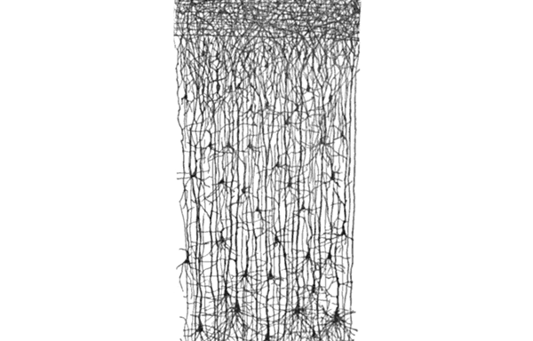

<section>
<aside>

</aside>

The neocortex is complex. It contains dozens of cell types, numerous layers, and intricate connectivity patterns. The connections between cells suggest a columnar flow of information across layers as well as a laminar flow within some layers. Fortunately, this complex circuitry is remarkably preserved in all regions. Vernon Mountcastle [1] was the first to propose that a canonical circuit consisting of cortical columns underlies everything the neocortex does. The way we see, feel, hear, move – and even do high level planning runs on the same circuitry.

If we can understand how a single cortical column works, we will have a framework for understanding how the entire neocortex works. Understanding the function of cortical columns is a central goal of our research program.
</section>
<section>
<aside>

</aside>
In our October 2017 paper [1], we proposed a surprising idea: that a single cortical column can learn models of complete objects through movement. We proposed there is a key feature common to all cortical columns: a signal representing location. This location signal represents a location relative to the object being sensed, not relative to the sensor. In other words, a column knows not only what feature is being sensed, but where that feature is on the object. As we move our sensors, the “features at locations” input is integrated over time so that a single column can learn and recognize complete objects.

Under this proposal, cortical columns have far more powerful recognition and modeling capabilities than previously assumed.  It is consistent with Mountcastle’s original idea, and the concept that if the neocortex is doing a function somewhere, it must be doing it everywhere. This idea also has large implications for how we think about biological and machine intelligence, a subject of our blog post, “The Thousand Brains Model of Intelligence”.
</section>

### Cortical Columns Resources

#### Papers

<b>[1]</b> <a href="https://numenta.com/resources/papers/a-theory-of-how-columns-in-the-neocortex-enable-learning-the-structure-of-the-world/">Hawkins, J., Ahmad, S., & Cui, Y. (2017) A Theory of How Columns in the Neocortex Enable Learning the Structure of the World. <i>Front. Neural Circuits</i>, <b>11</b>, 81.</a>

#### Videos
*	[Does the neocortex use grid cell-like mechanisms to learn the structure of objects?](/company/events/2018/04/16/simons-institute-berkeley/)
*	[Have We Missed Half of What the Neocortex Does? Allocentric Location as the Basis of Perception](/resources/papers-videos-and-more/jeff-hawkins-mit-talk/)

#### Posters
*	[Cosyne 2018: Determining Allocentric Locations of Sensed Features](/resources/papers-videos-and-more/cosyne-2018-allocentric-locations-of-sensed-features/)
*	[NCM 2017: A Cortical Circuit for Sensorimotor Learning and Recognition](/resources/papers-videos-and-more/ncm-2017a-cortical-circuit-for-learning-sensorimotor-representations/)
*	[Cosyne 2017: How Do Cortical Columns Learn 3D Sensorimotor Models?](https://numenta.com/resources/papers-videos-and-more/cosyne-2017-how-do-cortical-columns-learn-3d-sensorimotor-models/)
