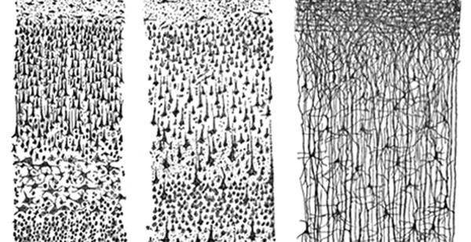
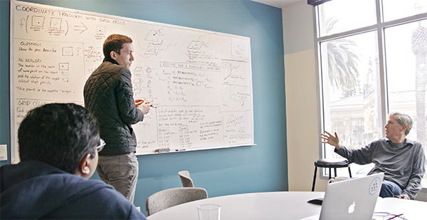
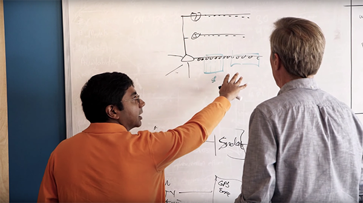
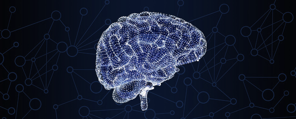
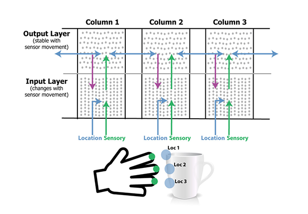
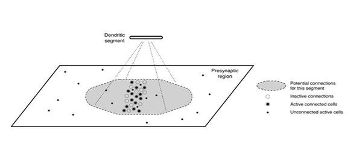

## Our Goal
___
<section>
<aside>

</aside>

Through our focus on cortical theory, we seek to understand the complex circuitry of a cortical column. We want to understand the function and operation of the laminar circuits in the brain, including what the neurons are doing, what the layers are doing, how they interact, and how a cortical column works.

[Vernon Mountcastle](https://en.wikipedia.org/wiki/Vernon_Benjamin_Mountcastle) proposed that because every part of the neocortex has the same complex circuitry, then every part is doing the same thing.  Therefore, if we can understand a cortical column, we will understand the neocortex.  

</section>

## Our Approach
___
<section>
<aside>

</aside>

We are often asked how we do neuroscience research at Numenta and what it means to focus on cortical theory. We read many neuroscience papers and published results to get an understanding of what the neocortex does. We propose ideas about how the detailed architecture of the neocortex implements these functions. We ensure our work satisfies biological constraints and test our theories via simulation. Since we do not do any wet lab work, we collaborate with experimentalists that run investigations and give us feedback.

</section>
<section>
<aside>

</aside>

We document our research in several ways, including [peer-reviewed journal papers](/resources/papers/), conference proceedings, research reports, [invited talks](/events/), and a living book titled [BAMI](/resources/biological-and-machine-intelligence/) (Biological and Machine Intelligence). In addition, we place our daily research commits in an [open source project](http://numenta.org/). We strive to be completely open in everything we do.

</section>

## Our Theory
___
<section>
<aside>

</aside>
Although there is much to do, we have made significant progress on several key aspects of cortical theory. We are filling in the pieces of the common cortical circuit that underlines all of intelligence.  Through our series of discoveries- from how neurons make predictions to how cortical columns learn to model objects through movement-we’ve developed a framework for biological intelligence. We refer to this theory as Hierarchical Temporal Memory (HTM).

</section>

## Our Research Focus Areas
___
### Cortical columns

<section>
<aside>

</aside>
Building on Mountcastle’s proposal that the neocortex is made up of identical cortical columns, we are working on filling in the pieces of the cortical circuit – understanding each layer, what the neurons are doing and how a cortical column works. As part of this research, we have proposed a detailed model, consistent with anatomical and physiological evidence, that cortical columns learn sensorimotor models of the world by combining sensory inputs with a movement updated allocentric location signal.

Find more information on [cortical columns](/neuroscience-research/cortical-theory/cortical-columns/).

</section>

### Sequence learning

<section>
<aside>

</aside>
We have developed a theoretical framework for sequence learning – what we consider the most fundamental operation of all neocortical tissue.  We’ve shown how a biologically detailed model of pyramidal neurons with thousands of synapses and active dendrites can learn transitions of patterns, and how a network of neurons can form a robust sequence memory.

Find more information on [sequence learning](/neuroscience-research/cortical-theory/sequence-learning/) and prediction in cortex.

</section>

### Sparse distributed representations

<section>
<aside>

</aside>
Sparse distributed representations (SDRs) are a foundational aspect of HTM Theory.  They are how the brain represents its input and the state of its world, with very few neurons active at any given time. The unique properties of SDRs enable semantic generalization and robustness to noise.

Find more information on [sparse distributed representations](/neuroscience-research/cortical-theory/sparse-distributed-representations/).

</section>
