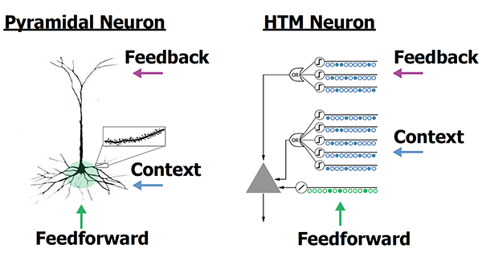
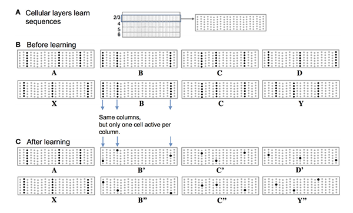

<section>
<aside>

</aside>

Much of our research focuses around one fundamental observation: that the neocortex is constantly predicting its inputs. We started by addressing the following question: how do networks of neurons make predictions and learn the temporal structure in streams of sensory data?

We first developed a theoretical framework for sequence learning in the cortex that proposes a new understanding of how neurons work, based on the idea that every pyramidal cell is a prediction machine. In [1] we show how a single pyramidal neuron with active dendrites can recognize hundreds of unique patterns and contexts in which it can predict its input. We then show that a network incorporating such neurons can learn complex sequences in a surprisingly robust and flexible manner. The model learns in a completely unsupervised fashion and, as a continuously learning system, adapts rapidly to changes in its input.

We used the same framework in a subsequent paper [2] to model the sensorimotor input layer. In that paper, the context for each neuron was a location signal derived from motor signals, rather than the past input. In [3] we further showed that such a layer of neurons can discriminate the type of context that is most related to the input and thus simultaneously learn both external temporal sequences as well as sensorimotor sequences. Our work helps to explain why neurons need so many synapses and why dendritic spikes are so important. The theory makes a number of testable predictions, which are detailed in our papers.

Sequence learning continues to be an active area of research at Numenta. We are considering extending the model to incorporate specific time intervals between sequence elements (such as the timing of notes in a melody). We would also like to extend the neuron model to explicitly incorporate apical dendrites and feedback.
</section>

### Applications of sequence learning

<section>
<aside>

</aside>
Although primarily a biological model, our sequence learning framework has practical applications in temporal prediction and anomaly detection. In [4] we show how our sequence learning algorithm is applied to temporal prediction with streaming data. We compare the algorithm against a number of common machine learning techniques. Our model achieves static performance on par with state of the art techniques, while displaying improved performance on several important properties like continuous online learning, the ability to handle multiple predictions, robustness to sensor noise and fault tolerance, and good performance without the need for task-specific tuning.

Our sequence learning framework is also applicable to [anomaly detection for real-time streaming data](/applications/numenta-anomaly-benchmark/). Most approaches to anomaly detection process data in batches, whereas streaming applications require processing and learning with each data point. In [5] we compared our model against a number of anomaly detection techniques on a comprehensive benchmark dataset, where it achieved the top score.

</section>

### Sequence Learning Resources

#### Papers

<b>[1]</b> <a href="https://numenta.com/resources/papers/why-neurons-have-thousands-of-synapses-theory-of-sequence-memory-in-neocortex/">Hawkins, J. & Ahmad, S. (2016) Why Neurons Have Thousands of Synapses, a Theory of Sequence Memory in Neocortex. <i>Front. Neural Circuits</i>, <b>10</b>, 1–13.</a>
<b>[2]</b> <a href="https://numenta.com/resources/papers/a-theory-of-how-columns-in-the-neocortex-enable-learning-the-structure-of-the-world/">Hawkins, J., Ahmad, S., & Cui, Y. (2017) A Theory of How Columns in the Neocortex Enable Learning the Structure of the World. <i>Front. Neural Circuits</i>, <b>11</b>, 81.</a>
<b>[3]</b> <a href="https://www.biorxiv.org/content/early/2017/09/19/190678">Ahmad, S. & Hawkins, J. (2017) Untangling Sequences: Behavior vs. External Causes. <i>bioRxiv</i>, 190678.</a>
<b>[4]</b> <a href="https://www.numenta.com/resources/papers/continuous-online-sequence-learning-with-an-unsupervised-neural-network-model/">Cui, Y., Ahmad, S., & Hawkins, J. (2016) Continuous online sequence learning with an unsupervised neural network model. <i>Neural Computation.</i>, <b>28</b>, 2474–2504.</a>
<b>[5]</b> <a href="https://www.numenta.com/resources/papers/unsupervised-real-time-anomaly-detection-for-streaming-data/">Ahmad, S., Lavin, A., Purdy, S., & Agha, Z. (2017) Unsupervised real-time anomaly detection for streaming data. <i>Neurocomputing</i>, <b>262</b>, 134–147.</a>

#### Videos
*	[Have We Missed Half of What the Neocortex Does? Allocentric Location as the Basis of Perception](/resources/papers-videos-and-more/jeff-hawkins-mit-talk/)
*	[A Theory of How Columns in the Neocortex Enable Learning the Structure of the World](/resources/papers-videos-and-more/how-columns-in-the-neocortex-enable-learning-the-structure-of-the-world/)
*	[HTM Chat with Jeff Hawkins - Video Series](/resources/papers-videos-and-more/htm-chat-with-jeff-hawkins/)
*	[HTM School: Temporal Memory Part 1](https://www.youtube.com/watch?v=UBzemKcUoOk)
*	[HTM School: Temporal Memory Part 2](https://www.youtube.com/watch?v=1OhY_u3NjdM)

#### Posters and Presentations
*	[CNS 2017: A Neural Mechanism for Sequence Learning – HTM Sequence Memory](/resources/papers-videos-and-more/cns-2017-a-neural-mechanism-for-sequence-learning/)
*	[Bernstein Conference 2016: HTM Sequence Memory for Sequence Learning](/resources/papers-videos-and-more/bernstein-conference-2016-HTM-sequence-memory/)
*	[Cosyne 2016: Introducing HTM Sequence Memory](/resources/papers-videos-and-more/cosyne-2016-introducing-htm-sequence-memory-theory/)
*	[The Predictive Neuron: How Active Dendrites Enable Spatiotemporal Computation in the Neocortex](https://www.slideshare.net/numenta/the-predictive-neuron-how-active-dendrites-enable-spatiotemporal-computation-in-the-neocortex-by-subutai-ahmad-02082018-88009150)
