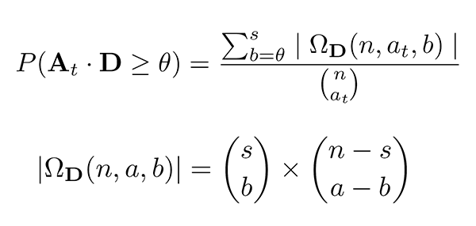

<section>
<aside>

</aside>
One of the most remarkable observations about the neocortex is that no matter where you look, the activity of neurons is sparse, meaning only a small percentage of them are spiking at any point in time. The sparsity might vary from less than one percent to several percent, but it is always sparse. Sparse distributed representations (SDRs) model this property and are a key component of HTM theory [1].

Our research on SDRs is aimed at uncovering properties of sparse representations that provide insight into the neocortex. The research also provides a practical mathematical framework that helps explain some of the numbers and parameters used in HTM systems.
</section>

Our research has focused on binary sparse distributed representations, i.e. an array consisting of a large number of bits where a small percentage are 1’s and the rest are 0’s. The bits of SDRs correspond to neurons in the brain, where 1 represents an active neuron and 0 an inactive one. Each bit typically has some meaning (such as the presence of an edge at a particular location and orientation). The information is distributed amongst the bits such that no single bit is critical.

### How accurately can neurons recognize sparse patterns?

<section>
<aside>

</aside>

In [2] we show that high dimensional sparse patterns can be classified extremely reliably, even in the presence of large amounts of noise and failures. We discuss the union property, which allows multiple patterns to be simultaneously represented and recognized. This property is what enables HTM sequence memory to make multiple predictions about the future. The paper derives scaling equations for computing the probability of false positive and false negative errors, both with and without unions.

Through active dendrites, a neural property that is a key underpinning of HTM theory, neurons are thought to detect patterns using a small number of synapses (as few as 10 to 20 synapses). Given that neural populations are large, and their activity is extremely unreliable and noisy, how could neurons reliably detect patterns with such a tiny number of synapses? The above scaling laws show that under a range of numbers, even 10 to 20 synapses can accurately classify patterns under very noisy conditions. The equations can even be used to explain the experimentally observed thresholds in active dendrites (see Cosyne poster below).
</section>

### Sparse Distributed Representations Resources

#### Papers

<b>[1]</b> <a href="https://numenta.com/resources/papers/htm-spatial-pooler-neocortical-algorithm-for-online-sparse-distributed-coding/">Cui, Y., Ahmad, S., & Hawkins, J. (2017) The HTM Spatial Pooler – a neocortical algorithm for online sparse distributed coding. <i>Front. Comput. Neurosci.</i>, <b>11</b>, 111.</a>
<b>[2]</b> <a href="http://arxiv.org/abs/1601.00720">Ahmad, S. & Hawkins, J. (2016) How do neurons operate on sparse distributed representations? A mathematical theory of sparsity, neurons and active dendrites. <i>arXiv</i>, arXiv:1601.00720.</a>
<b>[3]</b> <a href="https://numenta.com/resources/biological-and-machine-intelligence/">Hawkins, J. et al. (2016) Biological and Machine Intelligence. Sparse Distributed Representations chapter.</a>

#### Videos
*	[Sparse Distributed Representations - Our Brain's Data Structure](/resources/papers-videos-and-more/sparse-distributed-representations/)
*	[SDR Capacity & Comparison (HTM School, Episode 2)](https://www.youtube.com/watch?v=ZDgCdWTuIzc)
*	[SDR Overlap Sets and Subsampling (HTM School, Episode 3)](https://www.youtube.com/watch?v=vU2OZdgBXAQ)
*	[SDR Sets & Unions (HTM School, Episode 4)](https://www.youtube.com/watch?v=8WIzIBaLXIs)

#### Posters
*	[Cosyne 2018: Sparse Distributed Representations](/resources/papers-videos-and-more/cosyne-2018-sparse-distributed-representations/)
